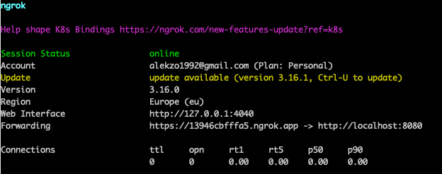
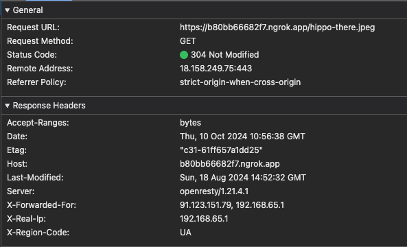
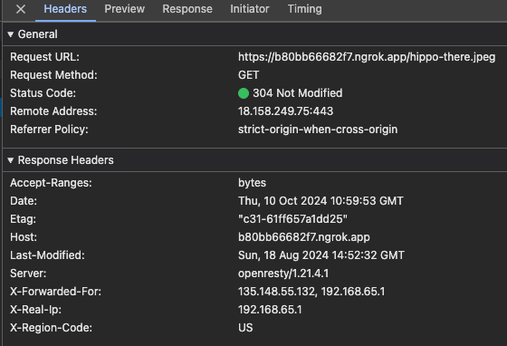
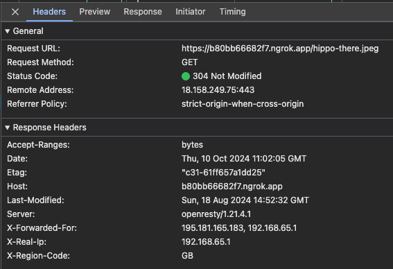

# hsa-load-balancing

# Task
1. Set up load balancer on nginx that will have 1 server for UK, 2 servers for US, and 1 server for the rest.
2. In case of failure, it should send all traffic to back up server.
3. Health check should happen every 5 seconds.

*Please use ngrok and touch vpn Chrome extension.

# How to start
1. Navigate to repository root and run `docker-compose up -d`

# How to test
1. Run ngrok to expose your local port 8080 to internet `ngrok http http://localhost:8080`
   1. 
2. Navigate via browser to ngrok outer address and URI `{ngrok_address/hippo-there.jpeg}` and observe in inspector its response headers
   1. 
   2. Also in console of fallback container there is record about request to this file
3. Enable VPN of your choice and set tunnel to US and GB
   1. 
   2. 
   3. Observe consoles of corresponding containers - image will be requested from corresponding container
4. Disable all containers except back up container and request image with/without VPN enabled - in all cases request will take a bit longer, and image will be requested from back up server 